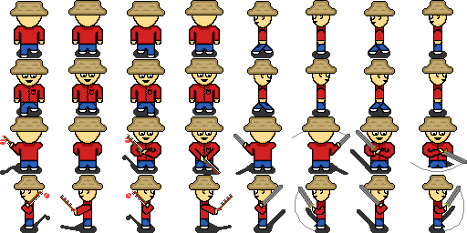

# Fish-landia

### Start

Fish-landia is a game written in Lua and ran with LOVE2D. The goal of the game is to catch every type of fish, whilst fighting off evil slimes. In doing so, the game will end and bring you to a screen that shows off some interesting stats about your playthrough. In addition to catching every type of fish, dying from slimes will also end the game and bring you to a screen that shows the same interesting stats.

### Game Over

## How to get started

You can download the .zip file and extract to a preffered location. Then download and install love2d. Once you have done these two steps, you can simply drag the game file onto the love2d application to start playing.

## Why make this game?

I've spent countless hours getting this game to the point it is at now all because of inspriration from a popular game, Stardew Valley. I really enjoyed the fishing aspect of Stardew Valley and so I decided I would try my hand at making a game that puts more focus on that, while still having a little excitement in the form of combating evil slimes. Though I can't say that this game is anywhere near the level of Stardew Valley, I've learned so much from working on this project and am very proud of what I've accomplished.

## Graphics & Sounds

All of the graphics and sounds are made by myself with the help of a pixel art program called Aseprite and two audio production softwares, FL-Studio and Bfxr. Though I could have found many of the graphics and sound effects for free online that would have sufficed, I decied to do it all myself so that I could dip my hands into every aspect of making a game. In addition to learning a lot with regards to the coding aspect of games, I also have greatly improved in my pixel art and sound creation ability, which at the beging of the project was basically nil.

## UI

### Starting Area

Most of the UI is interactable via the mouse, and clickable items change transparency when the mouse is hovering over said items. Initially the clickable items are slightly transparent in order to not obscure and take over the available screen. There are four clickable items on the play screen, "shop", "sell", trophy symbol (achievements), and "quit".

When "shop" is clicked, the screen displays a shop with options to buy more advanced lures than the basic one provided at start as well as the option to buy health with a "buy" button that is displayed red when the player doesn't have enough money and gold when the player can afford them. There is an "exit" button on the top left that brings the player out of the shop. This "exit" button is in the same location in the achievements and performs the same. 

### Shop

When the trophy symbol is clicked, the screen displays a grid of fish shadows that are colored as each fish is caught as well as a completion percentage that increases as new fish are caught. When "sell" is clicked, the fish that the player is holding on to are sold and a graphic appears above the player's money was gained. When the "quit" button is clicked, the game closes.

### Achievements

In addition to the clickable items, there are non clickable items, day/night cycle indicator, tutorial messages, and usage messages.

The day/night cycle displays whether it is day or night via text and a progress bar that changes over time as day turns to night and nigt turns to day. The change in time is achieved by a simple timer that decrements via daltatime. When day turns to night the timer is reset and the screen gets a transparent black rectangle drawn over it to give the illusion that it is dark and when the night turns to day the timer is reset and the black rectangle is no longer drawn.

## The Player

The player is a simlpe fisherman equiped with a pole and a sword with one one goal, catch every fish possible. He is first spawned in a starting location with a river hidden hidden to the left an ocean hiddien to the right. A simple and straight forward tutorial in the form of messages appear in the top left of the screen that explain how to play and the goal of the game. This tutorial is optional via a check box on the start screen, due to the possibility of death and having to start over.

### River

### Ocean

The player's movement is comprised of a walk speed and four sprites for each direction. The movement is achieved via timers that switch between which sprite is drawn depending on how much time has elapsed. Similar to walking, casting the rod and swinging the sword are achieved with multiple sprites for each direction which change via timers. The cast distance is determined by how long the left mouse button is held down and given a maximum value so as to not cast beyond the screen. A bobber is drawn at the end of the line and bobs up and down via a Knife library timer. In addition to a maximum power, casting anywhere other than water results in the player reverting back to idle. The sword hit box is variable depending on the direction the player is facing and this is to account for the change in sprite width and to create a more 3D feel to fighting. 

The player's inventory is a container with a current lure type, which lures are owned, money, which fish have been caught and which fish are currently on hand (displayed at the bottom of the screen). These variables are used to determine which area can be fished, what fish can be caught, what the player can afford in the shop, and the player's completion progress.

## The Slimes

The slimes are contained in a table and only spawn at night in the river and ocean areas. While it is day or the player is in the starting area, the slimes are forced to idle. When it turns night and the player is in the river or ocean area, the slimes go to their walking state which consists of moving a certain distance in the direction they are facing then randomly chosing a new direction once they stop. The movement animation is similar to the player's movement in that each color slime has multiple sprites for each direction that are switched between with a timer.

A random number of slimes are spawned indeffinately on a timer during night if the player is in the river or ocean area. If the player is not in the area or it is daytime, the spawn timer is not active.

If the slimes collide with a wall they stop and turn in the oppsite direction. When they collide with the player, they stop moving and the player is damaged and knocked back. Shortly after the player is knocked back, the slime will go back to moving. When player hits a slime with their sword, the slime stops moving and is knocked back, shortly after they resume their movement.

The knockback for the slimes and the player is achieved via Knife library timers that in the case of left/right collision tween the "y" coordinate up and back to the original "y" coordinate as the "x" coordinate is tweened a certain distance and in the case of top/bottom collision tween the "y" coordinate a certain distance.

Depeneding on color, the slimes have dirrenet amounts of health. When the slimes are killed they award the player with a variably random amount of money based on the color of slime.